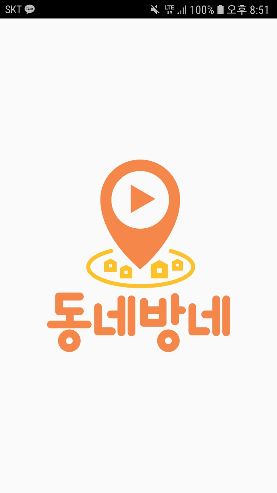
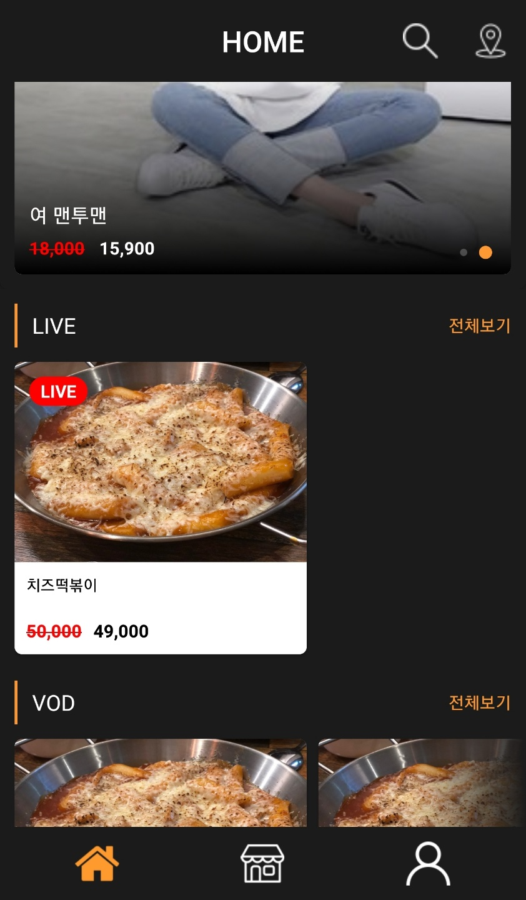
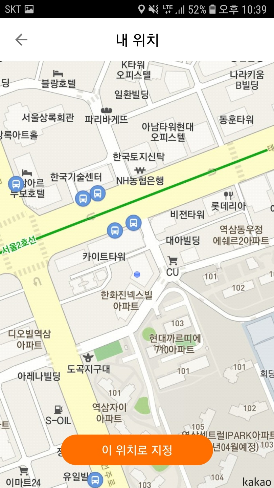
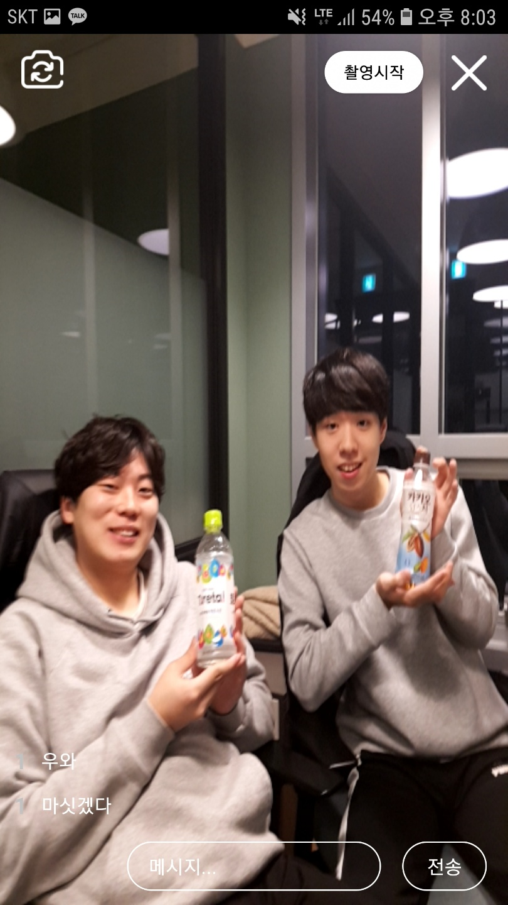
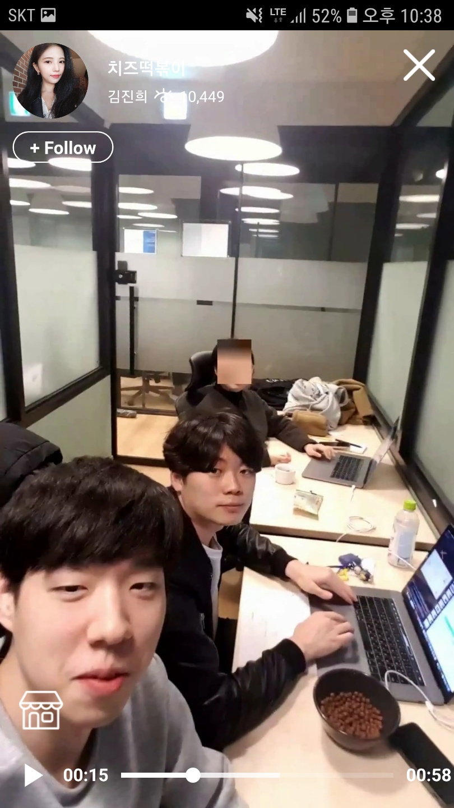
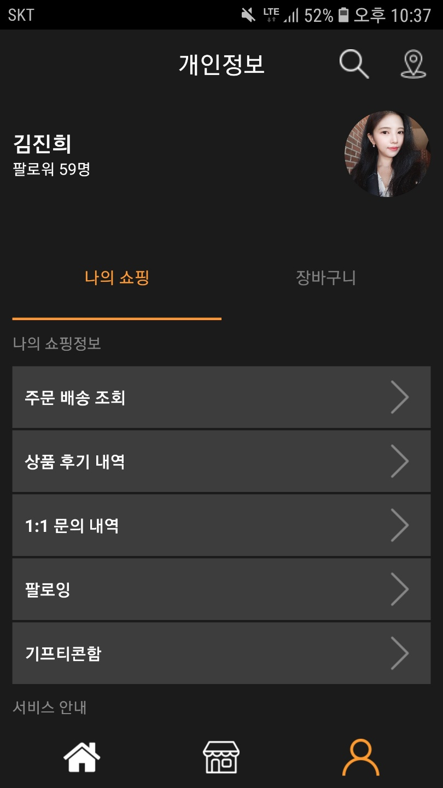
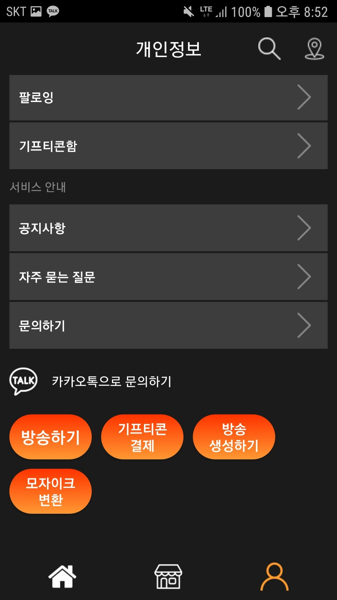

# DNBN
소프트웨어 마에스트로 10기
 
Team: 골목대장
 
동네방네 Mobile App

### IDE
- Android Studio 3
- API: 28(8.0)

### Library
- Google Tag Manager & Firebase 17.0.0
- Retrofit2 2.6.2
- ExoPlayer 2.9.6
- Picasso 2.71828
- [pedroSG94.rtmp-rtsp-stream-client-java:rtplibrary:1.6.8](https://github.com/pedroSG94/rtmp-rtsp-stream-client-java)
- [com.google.zxing:core:3.2.1](https://github.com/zxing/zxing)
- [Kakao Maps](http://apis.map.kakao.com/android/guide/)

### Preview
#### Logo
</img>
##### Home
</img>
##### Location
</img>
#### Live
</img>
#### VOD
</img>
#### User
</img>
#### Etc.Btn
</img>
#### Channel
</img>
#### Gifticon
</img>

### Code Description
- None

### ISSUE
#### rtmp-rtsp camera Resolution Issue
- Width와 Height이 실제 스마트폰의 가로 세로 순서로 넣으면 안됨(1080x1920 폰이라면 width:1920 height:1080으로 지정해야 함)
- 스마트폰의 API 버전에 따라 맞는 preview가 있음(API 28의 경우 lightopengl)

#### RecylcerView NotifyDataChange
- 데이터셋이 그대로일 경우, 에러를 띄움
- 매 번 RecyclerView에 넣는 item 객체를 새롭게 초기화 시켜주어야 함

#### onActivityResult
- Fragment에서 호출하였더라도, 무조건 base Activity의 onActivityResult가 먼저 실행
- request code로 처리

#### ExoPlayer 화면 터치 문제
- onTouch 함수 반응을 먹음(Preemptive)
~~~kotlin
val gestureDetector = GestureDetector(this, SingleTabConfirm())
vodExoPlayerView.setOnTouchListener(object : View.OnTouchListener {

    override fun onTouch(p0: View?, p1: MotionEvent?): Boolean {
        if (gestureDetector.onTouchEvent(p1)) {
            Log.d("myTest", "onTouch 됨")
            return true
        } else {
            Log.d("myTest", "onTouch false")
        }
        return false
    }

})
~~~
~~~kotlin
private inner class SingleTabConfirm : GestureDetector.SimpleOnGestureListener() {

        override fun onSingleTapUp(e: MotionEvent?): Boolean {
            Log.d("myTest", "onSingleTabUp")
            if (lytVODWatch.visibility == View.VISIBLE) {
                lytVODWatch.visibility = View.GONE
                vodExoPlayerView.hideController()
            } else {
                vodExoPlayerView.showController()
                lytVODWatch.visibility = View.VISIBLE
            }

            return true
        }
    }
~~~

#### Keyboard Height
- 소프트 키보드 높이 문제(adjustNothing)
[KeyboardHeightProvider.kt](./app/src/main/java/com/swma/dnbn/util/KeyboardHeightProvider.kt) 추가
- 사용
~~~kotlin
override fun onKeyboardHeightChanged(height: Int, orientation: Int) {
        if (height == 0) {
            relativeView.y = initialY
            rv_chat.y = initialYofChat

            relativeView.requestLayout()
            rv_chat.requestLayout()
        } else {
            val newPosition = initialY - height
            val newPositionofChat = initialYofChat - height
            relativeView.y = newPosition
            rv_chat.y = newPositionofChat

            relativeView.requestLayout()
            rv_chat.requestLayout()
        }
    }
~~~
~~~kotlin
class BroadCastActivity : AppCompatActivity(), ... ,
    KeyboardHeightProvider.KeyboardHeightObserver {
~~~
~~~kotlin
keyboardHeightProvider = KeyboardHeightProvider(this)
relativeView = lytChatInput

// Get Keyboard height
Handler().postDelayed({
    initialY = relativeView.y
    initialYofChat = rv_chat.y
    lytBroadCastFull.post { keyboardHeightProvider.start() }
}, 200)
~~~

#### GridLayout 크기 문제
- 기존에는 ItemDecorator를 이용하여 직접 너비 조정
- 단순히 Item의 너비를 match_parent로 지정, span count 갯수에 맞춰 너비가 알아서 조정 됨

#### TabLayout 상단 고정
- AppBarLayout의 Collapse AppBar 기능 활용
- ViewPager에 스크롤 이벤트 코드 추가 -> app:layout_behavior="@string/appbar_scrolling_view_behavior"

